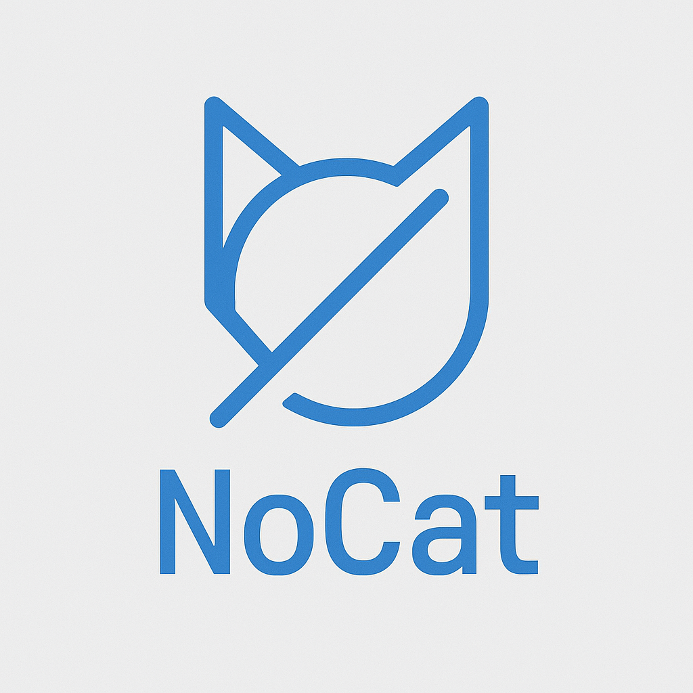

# NoCat

A harmless Netcat-lookalike for detection testing. Simulates nc-style command-line flags and listener behavior without exposing a backdoor or shell.

## What is NoCat

NoCat is a small Golang tool that imitates Netcat without performing any harmful actions.  
It accepts common nc-style flags (`-l`, `-p`, `-v`, `-e`, etc.) and can open a harmless TCP listener or create a simple outbound connection.  
It never spawns interactive shells, never pipes socket data into processes, and never provides remote access.  
Its only goal is to generate realistic artefacts for detection engineering without deploying real attacker tooling.

## Features

- Accepts core Netcat flags:
  - `-l` listen mode  
  - `-p` port  
  - `-v` verbose  
  - `-e` exec syntax (simulated; behaves like Netcat’s flag but without binding any socket)  
  - additional dummy flags such as `-k` and `-n` for realism
- Opens a safe TCP listener that accepts connections, holds them briefly, then closes them
- Optional client mode for simple outbound connection tests
- Provides realistic command-line artefacts for EDR, DFIR and SOC testing
- Never forwards data, never creates remote shells, never implements backdoor logic

## Purpose

Detection engineering often requires:

- realistic network listeners  
- suspicious command-line patterns  
- process trees resembling offensive tooling  
- artefacts for SOC, DFIR and training labs  

Using real Netcat with execution features (`-e`) is often undesirable in controlled or audited environments.  
NoCat provides the appearance and behaviour patterns without the risk.

## Build

NoCat is pure Go and can be built or cross-compiled easily.  
Requires **Go 1.20+**.

### Build for the current platform

```bash
go build -o nocat nocat.go
```

### Cross-compile for Windows

```bash
GOOS=windows GOARCH=amd64 go build -o nocat_windows_amd64.exe nocat.go
GOOS=windows GOARCH=arm64 go build -o nocat_windows_arm64.exe nocat.go
```

### Cross-compile for macOS

```bash
GOOS=darwin GOARCH=amd64 go build -o nocat_darwin_amd64 nocat.go
GOOS=darwin GOARCH=arm64 go build -o nocat_darwin_arm64 nocat.go
```

### Unified build script (`build.sh`)

The repository includes a convenience script that builds all supported platforms in one run.

```bash
#!/bin/sh
set -e

GOOS=windows GOARCH=amd64 go build -o nocat_windows_amd64.exe nocat.go
GOOS=windows GOARCH=arm64 go build -o nocat_windows_arm64.exe nocat.go

GOOS=darwin GOARCH=amd64 go build -o nocat_darwin_amd64 nocat.go
GOOS=darwin GOARCH=arm64 go build -o nocat_darwin_arm64 nocat.go

echo "Build completed."
```

Make executable:

```bash
chmod +x build.sh
```

## Usage Examples

Listen on TCP 8080:

```bash
nocat -l -p 8080 -v
```

Simulated exec syntax (harmless):

```bash
nocat -l -p 8080 -v -e cmd.exe
```

In NoCat, the `-e` flag behaves syntactically like in Netcat but has no socket connection and no shell or command forwarding.

Persistence example (Windows Run key):

```cmd
reg add HKLM\Software\Microsoft\Windows\CurrentVersion\Run ^
  /v NoCatSvc ^
  /t REG_SZ ^
  /d "C:\ProgramData\nocat.exe -l -p 8080 -v -k -e cmd.exe" ^
  /f
```

## Name

Project name: **NoCat**  
A harmless Netcat-style simulator for safe detection testing.

## License

MIT (recommended).
